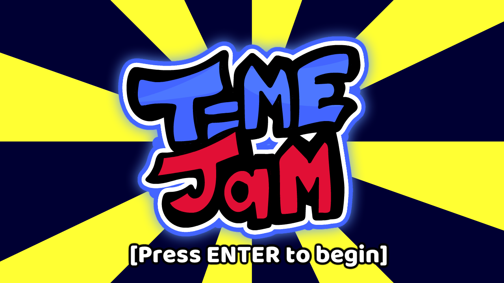
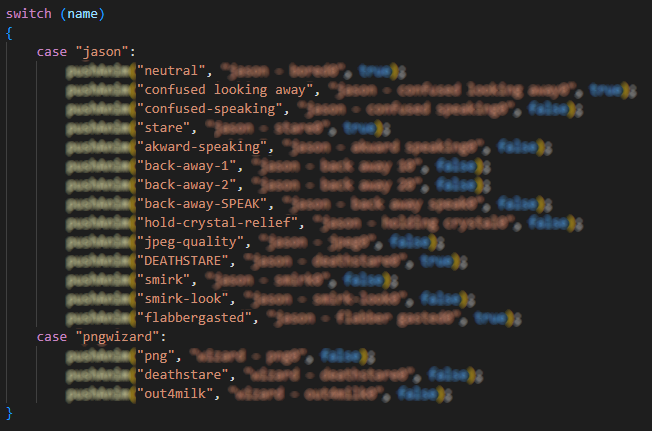

<p align="center">
  
</p>
<p align="center">
  An indie game made by <a href="https://www.github.com/DillyzThe1">DillyzThe1</a> & <a href="https://www.github.com/Impostor5875">Impostor5875</a> in just 5 days.
</p>
<p align="center">
  Originally made for the February 2023's <a href="https://itch.io/jam/haxejam-2023-winter-jam">Winter Haxe Jam</a>.
</p>


# TimeJam
A game made for HaxeJam (Feb 2023) where you must correctly configure the forbidden machine to progress further.<br>
Jumping from place to place, you'll be fighting your way through enemies to collect a few archaic crystals, which may power the machine.<br>
If you get the machine wrong or fail to get sufficent power, you must restart in a slightly altered timeline, losing your progress while gaining a shortcut.<br>

# How To Play
Download the game [[here]](../../releases/latest/) for your platform and run it.<br>
<i>Note: Web builds are available [[here]](https://dillyzthe1.itch.io/)!</i><br>
<br>
After you've launched the game, you'll be greeted with this screen:<br>
<br>
Hit enter and continue over the play button, in which the game will start.<br>
You must move all the way to the right to get some dialogue, and then you'll be greeted by someone to guide you.

# Dialogue Editing
Navigate to [`[assets/data/dialogue/]`](https://github.com/DillyzThe1/TimeJam/tree/main/assets/data/dialogue) in your installation of the game (or source code).<br>
You can edit any json file you want, but let's edit `pngintro.json`.<br>
Once you've opened that, you'll see an array called `dialogue`.<br>
This array contains every instance of dialogue, including those which are skipped automatically to sequence something cool.<br>
Let's go over every variable, so take this chart:
- `boxtype` - Can be any kind of box. This can be `none`, `left`, `right`, or `both`.
- `leftchar` - This is the character on the left hand side. Should either be `jason` or just the qoutes.
- `rightchar` - This is the character on the right hand side. Should either be `pngwizard` or just the qoutes.
- `speaking` - This is the side that is currently speaking. If put to `right` on when `boxtype` is `both`, the text comes from the right.
- `expressionleft` - This is the animation name for the left hand side. Check the chart below for animation names.
- `forceleft` - This determines if the left side animation should be restarted by force when this dialogue starts.
- `expressionright` - This is the animation name for the right hand side. Check the chart below for animation names.
- `forceright` - This determines if the right side animation should be restarted by force when this dialogue starts.
- `clear` - Setting this to `true` will wipe the text from the last dialogue, and `false` will keep it.
- `dialogue`- The raw spoken text. Can be literally anything in string qoutes.
- `skip_prompt` - Setting this to `false` will keep the ability to hit enter or read, while `true` immediantly cuts to the next dialogue. Good for comedy.
- `music_vol_mult` - The multiplier for the volume of the bg music relative to what the dialogue state sets it as.
- `speed` - The multiplier of the speed at which the text is shown.

Animation name chart:<br>
<br>
<br>
Reboot the game and open the dialogue you replaced.<br>
And there you go!<br>


# Level Editing
To edit the level's tiles and metadata, you'll need to download & install [[Tiled]](https://www.mapeditor.org/).<br>
After that, navigate to [`[assets/tm/]`](https://github.com/DillyzThe1/TimeJam/tree/main/assets/tm) in your installation of the game (or source code).<br>
Double click the TMX file to load it into the editor, and you should see everything pop up.<br>
<br>
<br>
Here, you can explore all the properties and values I've left to work with eachother. Have fun!<br>
No documentation comes until high demand.

# Compiling
*Note: IF you publish a public modification to this game, you <b>MUST</b> open source it on github & add a link to the source code.*<br>
*Also Note: Pull requests of a full-on mod/engine will likely <u><b>not</b> be added</u>. Open an issue under the enhancement tag.*<br>
*Also ALSO Note: If you're just wanting to edit levels or dialogue, use the tutorials above. They do not require recompiling.*<br>
<br>
Download Haxe [4.2.5 64-bit](https://haxe.org/download/file/4.2.5/haxe-4.2.5-win64.exe/) or [4.2.5 32-bit](https://haxe.org/download/file/4.2.5/haxe-4.2.5-win.exe/).
<br>
Download the [source code of this repository](../..//archive/refs/heads/main.zip) or the [source code of the latest release](../../releases/latest).<br>
*Note: You can also fork the repository and clone with Github Desktop!*<br>
<br>
Extract the zip file and open the folder.<br>
You'll need the following libraries:
```batch
haxelib install lime
haxelib install openfl
haxelib install flixel
haxelib install flixel-addons
haxelib install flxanimate
haxelib git discord_rpc https://github.com/Aidan63/linc_discord-rpc
```
If discord presence is causing an error for you, make sure to remove [[this line]](https://github.com/DillyzThe1/TimeJam/blob/main/Project.xml#L53) before compiling.<br>
Anyway, after you've done that just run [`[build.bat]`](https://github.com/DillyzThe1/TimeJam/blob/main/build.bat) from the source folder and look at the instructions.<br>
<br>
*Note: Visual Studio Code is recommended for programming new features. Please install the appropiate plugins for haxeflixel in VSC.*<br>
